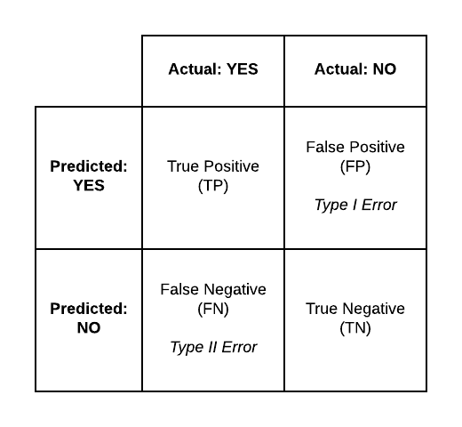

## Long, long ago....

A brave fellow student gave a presentation using the KNN matching algorithm to predict the class of an unknown (and possibly alien) species....

[*KNN Example* by Zach Dravis](http://rpubs.com/zdravis/368000)

Zach left us with a few questions at the end of the presentation, including:

* How to measure success [of the knn model]?
* How to empirically establish k?

In the comments section during the presentation, Prof. Catlin suggested using a confusion matrix to evaluate the models with different k values.  In this example, I will present the concept of the confusion matrix and apply it to Zach's KNN models.

```{r, echo = FALSE, warning = FALSE, message = FALSE}
set.seed(1234)

HumanHeight <- rnorm(200, mean = 5.5, sd = .5)
WookieHeight <- rnorm(200, mean = 7.0, sd = .75)
EwokHeight <- rnorm(200, mean = 4, sd = .5)

HumanWeight <- rnorm(200, mean = 150, sd = 30)
WookieWeight <- rnorm(200, mean = 200, sd = 50)
EwokWeight <- rnorm(200, mean = 125, sd = 30)

SWSpecies <- data.frame(Species = c(rep("Human", 200), rep("Wookie", 200), rep("Ewok", 200)), Height = c(HumanHeight, WookieHeight, EwokHeight), Weight = c(HumanWeight, WookieWeight, EwokWeight))

library(ggplot2)
library(dplyr)

#Split into training and test
TrainingData <- SWSpecies %>%
  group_by(Species) %>%
  slice(1:133) %>%
  ungroup()

TestData <- SWSpecies %>%
  group_by(Species) %>%
  slice(134:200) %>%
  ungroup()

library(class)


library(knitr)
library(kableExtra)
```

## Ewoks and Humans and Wookies

For Zach's presentation, he created a data set containing 200 Ewoks, 200 humans, and 200 Wookies, then built a data frame with simulated height and weight data for each case.  Then, he used a training set of 399 observations from his data set to build two models with different $k$ values ($k=3$ and $k=9$), which were then applied to the remaining 201 observations (the test data set).

## Running the process with two different $k$ values

Code from Zach Dravis to apply the two models:

$k=3$

```{r}
SpeciesPrediction <- knn(train = select(TrainingData, Height, Weight), 
                         test = select(TestData, Height, Weight), 
                         cl = TrainingData$Species, 
                         k = 3)
FirstTest <- cbind(TestData, SpeciesPrediction)
FirstTest %>%  kable("html", caption = "Test1: k = 3") %>%
  kable_styling(bootstrap_options = c("striped")) %>%
  scroll_box(height = "500px")
```

$k=9$

```{r}
SpeciesPrediction <- knn(train = select(TrainingData, Height, Weight), 
                         test = select(TestData, Height, Weight), 
                         cl = TrainingData$Species, 
                         k = 9)
SecondTest <- cbind(TestData, SpeciesPrediction)
SecondTest %>%  kable("html", caption = "Test2: k = 9") %>%
  kable_styling(bootstrap_options = c("striped")) %>%
  scroll_box(height = "500px")
```

## Baseline: Random simulation

With the two given models from Zach's presentation, I wanted to create a baseline model as a control to test against.  I simulated data to assign the Species attribute randomly to a list of 67 Ewoks, 67 humans, and 67 Wookies.

From *Data Science for Business*: "Comparison against a random model establishes that there is some information to be extracted from the data."

If the results of our models are better than a random simulation, we're looking at the right features to use in our models.

```{r}
simSpeciesPrediction <- c(rep("Human", 67), rep("Wookie", 67), rep("Ewok", 67))
randOrder <- sample(1:201, 201, replace = FALSE)
simSpeciesPrediction <- simSpeciesPrediction[randOrder]
BaseTest <- cbind(TestData, simSpeciesPrediction)
BaseTest %>%  kable("html", caption = "Baseline: Random") %>%
  kable_styling(bootstrap_options = c("striped")) %>%
  scroll_box(height = "500px")
```

## Is accuracy sufficient?

An intuitive first impulse to evaluate the model is to divide the number of correctly predicted results from the test data by the total number of observations in the test data.  This is known as Accuracy.

```{r}
#Accuracy of the Base model
(AccuracyBase <- sum(BaseTest$simSpeciesPrediction == BaseTest$Species)/length(BaseTest$simSpeciesPrediction))
#Accuracy of the FirstTest model (k = 3)
(AccuracyFirst <- sum(FirstTest$SpeciesPrediction == FirstTest$Species)/length(FirstTest$SpeciesPrediction))
#Accuracy of the SecondTest model (k = 9)
(AccuracySecond <- sum(SecondTest$SpeciesPrediction == SecondTest$Species)/length(SecondTest$SpeciesPrediction))
```

The test models have much greater accuracy than the random assignment simulation, so it seems like we're on the right track.  But the accuracy of a model doesn't tell the complete story of a model, and may in fact hide its flaws.

## Defining the Confusion Matrix



* Describe boxes
* Describe overall statistics (Accuracy and Error)
* Describe other statistics
* link to helpful website (http://www.dataschool.io/simple-guide-to-confusion-matrix-terminology/)

* Wikipedia example


Accuracy = $\frac{20 + 1820}{2030} \approx 90.6%$

Null Error Rate = 

Looking at the confusion matrix gives better information - for example, the Positive predictive value is only 10%.

## Back to our Star Wars example

```{r, echo = FALSE, eval = FALSE, message = FALSE, warning = FALSE}
## manual calculation commented out
BaseConfusionMatrix <- data.frame(EwokActual = c(sum(BaseTest$Species == "Ewok" & BaseTest$simSpeciesPrediction == "Ewok"),
                                  sum(BaseTest$Species == "Ewok" & BaseTest$simSpeciesPrediction == "Human"),
                                  sum(BaseTest$Species == "Ewok" & BaseTest$simSpeciesPrediction == "Wookie")),
                              HumanActual = c(sum(BaseTest$Species == "Human" & BaseTest$simSpeciesPrediction == "Ewok"),
                                  sum(BaseTest$Species == "Human" & BaseTest$simSpeciesPrediction == "Human"),
                                  sum(BaseTest$Species == "Human" & BaseTest$simSpeciesPrediction == "Wookie")),
                              WookieActual = c(sum(BaseTest$Species == "Wookie" & BaseTest$simSpeciesPrediction == "Ewok"),
                                  sum(BaseTest$Species == "Wookie" & BaseTest$simSpeciesPrediction == "Human"),
                                  sum(BaseTest$Species == "Wookie" & BaseTest$simSpeciesPrediction == "Wookie")))
rownames(BaseConfusionMatrix) <- c("EwokResult", "HumanResult", "WookieResult")
BaseConfusionMatrix

FirstConfusionMatrix <- data.frame(EwokActual = c(sum(FirstTest$Species == "Ewok" & FirstTest$SpeciesPrediction == "Ewok"),
                                  sum(FirstTest$Species == "Ewok" & FirstTest$SpeciesPrediction == "Human"),
                                  sum(FirstTest$Species == "Ewok" & FirstTest$SpeciesPrediction == "Wookie")),
                              HumanActual = c(sum(FirstTest$Species == "Human" & FirstTest$SpeciesPrediction == "Ewok"),
                                  sum(FirstTest$Species == "Human" & FirstTest$SpeciesPrediction == "Human"),
                                  sum(FirstTest$Species == "Human" & FirstTest$SpeciesPrediction == "Wookie")),
                              WookieActual = c(sum(FirstTest$Species == "Wookie" & FirstTest$SpeciesPrediction == "Ewok"),
                                  sum(FirstTest$Species == "Wookie" & FirstTest$SpeciesPrediction == "Human"),
                                  sum(FirstTest$Species == "Wookie" & FirstTest$SpeciesPrediction == "Wookie")))
rownames(FirstConfusionMatrix) <- c("EwokResult", "HumanResult", "WookieResult")
FirstConfusionMatrix

SecondConfusionMatrix <- data.frame(EwokActual = c(sum(SecondTest$Species == "Ewok" & SecondTest$SpeciesPrediction == "Ewok"),
                                  sum(SecondTest$Species == "Ewok" & SecondTest$SpeciesPrediction == "Human"),
                                  sum(SecondTest$Species == "Ewok" & SecondTest$SpeciesPrediction == "Wookie")),
                              HumanActual = c(sum(SecondTest$Species == "Human" & SecondTest$SpeciesPrediction == "Ewok"),
                                  sum(SecondTest$Species == "Human" & SecondTest$SpeciesPrediction == "Human"),
                                  sum(SecondTest$Species == "Human" & SecondTest$SpeciesPrediction == "Wookie")),
                              WookieActual = c(sum(SecondTest$Species == "Wookie" & SecondTest$SpeciesPrediction == "Ewok"),
                                  sum(SecondTest$Species == "Wookie" & SecondTest$SpeciesPrediction == "Human"),
                                  sum(SecondTest$Species == "Wookie" & SecondTest$SpeciesPrediction == "Wookie")))
rownames(SecondConfusionMatrix) <- c("EwokResult", "HumanResult", "WookieResult")
SecondConfusionMatrix
```

```{r}
library(caret)
confusionMatrix(BaseTest$Species, BaseTest$simSpeciesPrediction, dnn = c("Prediction", "Actual"))
confusionMatrix(FirstTest$Species, FirstTest$SpeciesPrediction, dnn = c("Prediction", "Actual"))
confusionMatrix(SecondTest$Species, SecondTest$SpeciesPrediction, dnn = c("Prediction", "Actual"))
```

$k=9$

```{r}
k_pref <- TrainingData$Species %>%
  length() %>%
  sqrt() %>%
  round()
SpeciesPrediction <- knn(train = select(TrainingData, Height, Weight), 
                         test = select(TestData, Height, Weight), 
                         cl = TrainingData$Species, 
                         k = k_pref)
ThirdTest <- cbind(TestData, SpeciesPrediction)
ThirdTest %>%  kable("html", caption = "Test2: k = 9") %>%
  kable_styling(bootstrap_options = c("striped")) %>%
  scroll_box(height = "500px")

(AccuracyThird <- sum(ThirdTest$SpeciesPrediction == ThirdTest$Species)/length(ThirdTest$SpeciesPrediction))


confusionMatrix(ThirdTest$Species, ThirdTest$SpeciesPrediction, dnn = c("Prediction", "Actual"))
```
